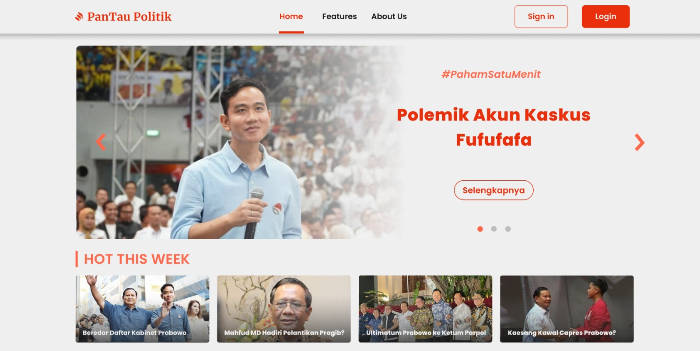
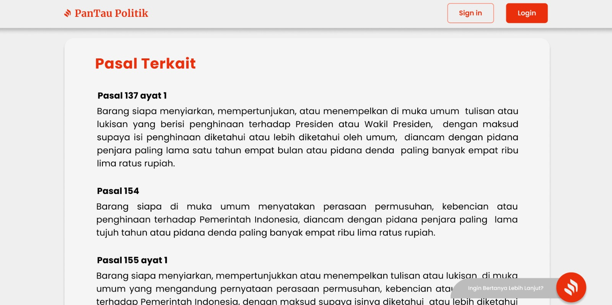
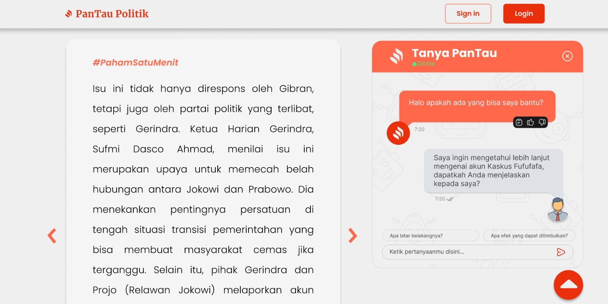

# **Pantau Politik**

**Pantau Politik** adalah platform informasi terkini yang menyajikan analisis mendalam tentang dinamika politik di Indonesia dengan pendekatan AI & Data Science. Kami berkomitmen untuk memberikan berita, artikel, dan perspektif yang objektif, sehingga Anda dapat memahami isu-isu politik yang memengaruhi kehidupan kita sehari-hari. Dengan menggunakan teknologi kecerdasan buatan dan ilmu data, kami menganalisis tren, pola, serta dampak kebijakan pemerintah dan debat publik secara mendetail. Pantau Politik hadir untuk memberikan Anda wawasan yang akurat, terpercaya, dan berbasis data, memungkinkan Anda melihat gambaran politik Indonesia secara lebih cerdas dan menyeluruh.

## Anggota Tim
- Alvinhugo Zuhdi - Data Engineer
- Deffin Purnama Noer - Machine Learning Engineer
- Syahel Rusfi Razaba - Machine Learning Engineer
- Syahrul Azka - Machine Learning Engineer

## Fitur Utama dan Metode
### 1. **Paham Satu Menit**

.jpeg)
**PahamSatuMenit** adalah fitur yang menyajikan rangkuman berita politik terkini secara cepat dan akurat, hanya dalam satu menit. Kami memanfaatkan **data berita** dari seluruh website di internet dan platform media sosial, kemudian merangkumnya menggunakan teknologi **text summarization** berbasis **Large Language Model** [GPT 4o-Mini](https://platform.openai.com/docs/models/gpt-4o-mini). Dengan teknologi ini, kami mampu mengemas berita secara sederhana namun informatif, sehingga semua pembaca, mulai dari profesional hingga masyarakat awam, dapat memahami isu-isu politik yang sedang hangat di Indonesia.

Fitur ini dirancang agar setiap orang dapat memperoleh gambaran yang **objektif** tentang berita atau kebijakan yang diberlakukan oleh pemerintah. Dengan sajian ringkas dan jelas, **PahamSatuMenit** membantu Anda menilai apakah suatu kebijakan benar-benar membawa manfaat bagi rakyat atau tidak, tanpa perlu menghabiskan banyak waktu untuk membaca berita panjang.

### 2. **Pasal Terkait**

**Pasal Terkait** adalah fitur inovatif yang menghubungkan berita politik terkini dengan **peraturan hukum** yang relevan, seperti **Kitab Undang-Undang Hukum Pidana (KUHP)**, **Peraturan Presiden (Perpres)**, **Undang-Undang Dasar (UUD)**, **Peraturan Pemerintah (PP)**, **Undang-Undang Ketenagakerjaan**, dan **Peraturan Menteri**. Kami membantu Anda menemukan pasal-pasal atau peraturan yang berhubungan langsung dengan isu yang sedang dibahas, sehingga Anda dapat memahami konteks hukum yang mendasari setiap kebijakan politik.

Menggunakan teknologi canggih, kami memanfaatkan **model embedding "text-embedding-3-small"** dari [OpenAI](https://platform.openai.com/docs/guides/embeddings), yang mengubah kata, kalimat, atau frasa dari undang-undang menjadi **representasi vektor berdimensi tinggi**. Fitur ini kemudian menggunakan **cosine similarity** untuk menghitung tingkat kemiripan antara isu yang dibahas dengan seluruh pasal yang ada di database kami. Pasal dengan nilai kemiripan tertinggi akan ditampilkan, sehingga Anda mendapatkan referensi hukum yang **paling relevan** dengan topik yang sedang hangat.

Dengan fitur **Pasal Terkait**, kami memberikan konteks hukum yang akurat, membantu pembaca memahami dasar kebijakan di balik setiap isu politik dan memberikan landasan yang kuat dalam memahami peraturan yang berlaku di Indonesia.

### 3. **Tanya Pantau**

**Tanya PanTau** adalah fitur chatbot berbasis **AI** yang dirancang untuk membantu pengguna menggali lebih dalam terkait isu-isu yang disajikan dalam fitur **Paham Satu Menit**. Dengan memanfaatkan **Large Language Model (LLM) GPT-4o Mini** dan pendekatan **Retrieval Augmented Generation** [(RAG)](https://aws.amazon.com/what-is/retrieval-augmented-generation/), Tanya PanTau mampu memberikan jawaban yang akurat dan relevan berdasarkan kumpulan informasi yang telah diproses.

Dalam arsitektur Tanya PanTau, kami menggunakan **model "text-embedding-3-small"** untuk mentransformasikan kata atau frasa menjadi **representasi vektor berdimensi tinggi**, sehingga memungkinkan mesin untuk mengidentifikasi kemiripan semantik antara pertanyaan pengguna dan informasi yang tersedia. Teknologi ini didukung oleh framework **Langchain** dan **ChromaDB**, yang bertugas mengelola penyimpanan dan pengambilan data berbasis vektor secara efisien.

Dengan Tanya PanTau, Anda dapat berinteraksi langsung dengan sistem yang telah dilengkapi dengan kemampuan untuk memberikan penjelasan yang komprehensif dan mudah dipahami terkait berbagai isu politik terkini.
